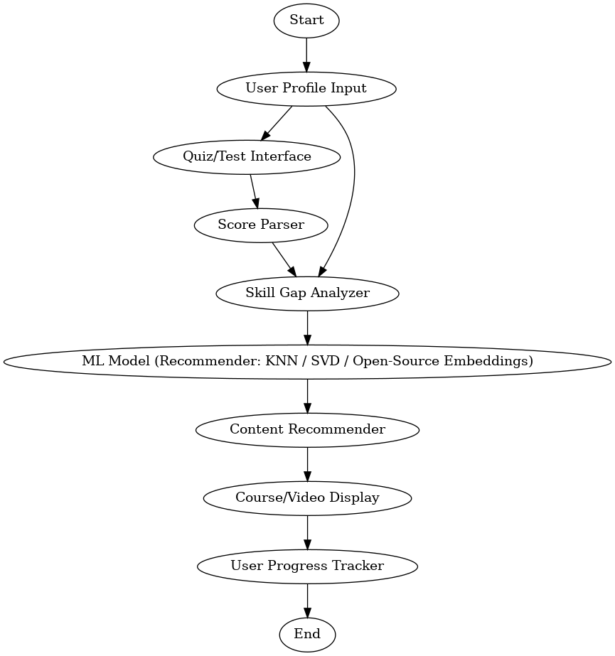

# 🚀 AI for Digital Literacy & Skill Development (Hackathon Plan)

## 🧾 Problem Statement
Leverage Artificial Intelligence to build a platform that helps individuals assess their digital skill levels and recommends personalized learning paths to bridge their skill gaps. The system should include a quiz or profile input, recommend skills or courses, and track user progress.

---

## 🗓️ 3-Day Roadmap

### 📅 Day 1 – Planning & Initial Build
- Finalize the project scope and architecture
- Prepare skill matrix dataset (CSV)
- Design and implement quiz UI (Streamlit)
- Implement basic recommendation logic (KNN / rule-based)
- Begin integrating Ollama for smart explanations

### 📅 Day 2 – Backend & Integration
- Set up Flask/FastAPI backend for quiz, recommender, chat
- Connect Ollama with chatbot interface
- Display skill recommendations based on quiz results
- Track progress and show feedback loop

### 📅 Day 3 – Testing, UI Polish, Documentation
- Polish UI & style
- Record user flow demo video
- Prepare slides & documentation
- Finalize GitHub repo and submission

---

## 👥 Team Role Division (for 4 Members)

| Member | Role | Tasks |
|--------|------|-------|
| A | 🧠 ML Engineer | Quiz scoring, recommender logic (KNN), dataset work |
| B | 🧰 Backend Developer | Flask/FastAPI APIs, Olama integration |
| C | 🎨 Frontend Developer | Streamlit UI, UX design, flow |
| D | 📋 Project Manager | Quiz questions, documentation, slides, demo video |

---

## 🧰 Technologies Used

- **Frontend:** Streamlit, HTML/CSS (optional)
- **Backend:** Flask / FastAPI, Python, Uvicorn
- **AI/ML Models:** scikit-learn (KNN), Ollama (LLaMA2/Mistral)
- **Chat Engine:** Ollama CLI + Python SDK
- **Data Handling:** Pandas, CSV files
- **Storage:** JSON or CSV (local), SQLite (optional)
- **Dev Tools:** VS Code, GitHub, Postman, Google Slides

---

## 🧱 Tech Stack Summary

| Layer | Technology | Purpose |
|-------|------------|---------|
| Frontend | Streamlit | UI for quiz, results |
| Backend | Flask / FastAPI | API logic for recommender/chat |
| ML Model | scikit-learn KNN | Skill recommendations |
| LLM | Ollama + LLaMA2 | Smart explanations |
| Storage | CSV / JSON / SQLite | Track user inputs, scores |
| IDE | VS Code / PyCharm | Dev environment |
| Version Control | Git + GitHub | Team collaboration |
| Docs | Google Slides / Canva | Final demo & slides |

---

## 🧠 Flowchart of the Solution

---

## ✅ Final Checklist

- [x] Quiz with skill-gap scoring logic
- [x] Recommender system (KNN or rule-based)
- [x] Ollama chat assistant integration
- [x] Streamlit-based user interface
- [x] Backend APIs for quiz and results
- [x] Final documentation and pitch-ready demo
